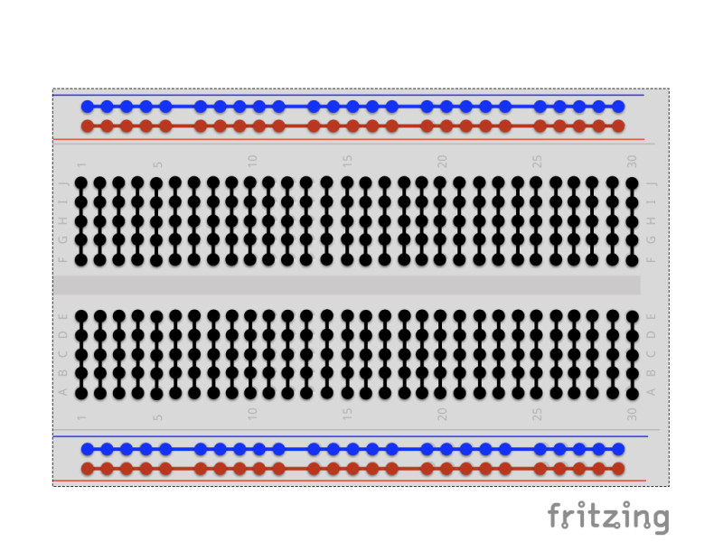
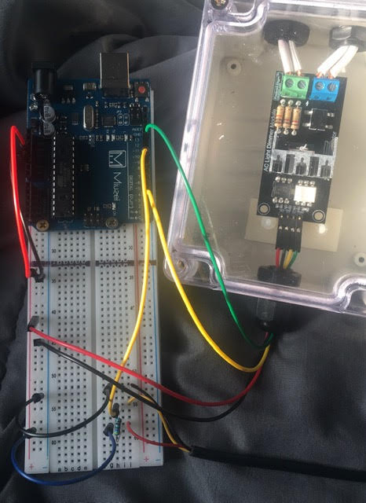

# Arduino Dimmer Thermostat
An Arduino-controlled light dimmer thermostat intended for animal use.
# Introduction
This project is intended to help you create an affordable dimmer thermostat for usage on animal enclosures (though I imagine it would work fine for other uses as well). This iteration of the design is fairly simple; it controls only one heat source based on temperature parameters set in the code. However, it would be easy to modify this design to accommodate additional heat sources, temperature warning alarms, clocks, or humidity probes. 

PLEASE NOTE THAT THIS PROJECT DOES INVOLVE SOME ELECTRICAL WIRING. DO NOT DO THIS IF YOU DO NOT KNOW WHAT YOU ARE DOING. I am not responsible for any damages if something goes wrong.
# Materials Needed
- An Arduino Uno or Arduino Uno Clone ~$15 (I am using Miuzei brand)
- RobotDyn AC Light Dimmer Module ~$3 [(link here)](https://robotdyn.com/ac-light-dimmer-module-1-channel-3-3v-5v-logic-ac-50-60hz-220v-110v.html)
- Breadboard ~$5
- Breadboard Jumper Wires ~$5
- Plastic Electrical Junction Box ~$7
- Basic Extention Cord ~$5
- DS18B20 Temperature Sensor with 4.7KΩ Resistors ~$10
- Active Buzzer Module ~$5 (OPTIONAL)

Approximate Total Cost: $50 (this is based off of prices I looked up and what I paid for things; might vary based on what materials you already have and which brands you buy)

What I personally did was buy an Arduino starter kit that came with the Arduino, breadboard, jumper wires, and buzzer. [This](https://www.amazon.com/Miuzei-Starter-Arduino-Tutorials-Mega2560/dp/B074QPTHNR/ref=sr_1_2?dchild=1&keywords=miuzei+arduino&qid=1618421125&sr=8-2) is the kit I got, and it came out to be about the same cost as buying all of those separately and came with a bunch of other cool stuff like a dedicated power source.  

I did not include the cost for basic tools needed (screwdriver, drill, wire cutters) as you should probably already have them. If you don't, then go buy a toolbox! They're super useful in general, not just for this project.

Also, make sure the bulb you're using is actually dimmable. 
# The Extension Cord and Dimmer
The dimmer we are using is an AC PWM dimmer. These dimmers basically work by chopping up the electrical signal in order to regulate the amount of power being delivered to the electronic. They're pretty easy to wire up, but please note that this is still working with 120V wires that can really mess you up. You should ALWAYS make sure everything is 100% unplugged before following any of the below steps. If you do everything correctly, you should never actually end up anywhere near a live wire. But once again, if something does go wrong, I take no responsibility. 
# Setting Up Your Breadboard
For this part of the tutorial, we will focus on connecting your Arduino to your breadboard. 

This image shows the basics of how a breadboard works. Small strips of metal run along the inside of the breadboard, connecting the holes in the manner above. Of particular note are the long red and blue rails running along the breadboard. The red rail is the live rail and will have the 5V from the Arduino running in it. The blue rail is the ground rail. If you would like to know more, I'd check out [this](https://magpi.raspberrypi.org/articles/breadboard-tutorial) link (also my image source).

For the purposes of this tutorial, I will refer to the long rails as vertical red or blue rails, and the short rails in the middle as horizonal rails.

This image shows a basic diagram of an Arduino Uno (image credits [here](http://arduinotogo.com/2016/09/09/chapter-3-arduino-schematic/)). For this project, we will only be concerned with the digital pins and the power and ground pins. 

### Connecting your Arduino to your breadboard:
1. Get four small male-male jumper wires. I would recommend two black ones and two red ones, but whatever works for you. Just try to keep it consistent.
2. Plug one side of one red wire into the 5V pin on the power and ground pin side of the Arduino. 
3. Plug the other side of the red wire into the red (live) rail on the breadboard.
4. Plug one side of the other red wire into the red rail.
5. Plug the other side of the red wire into one of the horizontal rails (NOT the red or blue rails - the rails in the middle).
4. Plug one side of one black wire into one of the GND pins on the power and ground pin side of the Arduino.
5. Plug the other side of the black wire into the blue (ground) rail on the breadboard.
6. Plug one side of the other black wire into the blue rail.
7. Plug the other side of the black wire into one of the horizontal rails near where the red wire was plugged in, but not the same rail.

If that explanation was confusing, here are images of my board (I only had one red wire, so one a dark blue wire was used in place of the other red):

 

If you would like to and if your breadboard is big enough, you can screw your Arduino into the breadboard using the Arduino screw holes for compactness' sake. HOWEVER, if you do so, make sure your go to the underside of your breadboard and strip any metal that may be touching the screws. I have all the metal in my breadboard above the black sharpie line stripped. This is to make sure that no power will conduct through the metal rails and into the Arduino's screws.

# Setting Up the Temperature Probe
Your temperature probe should have three wires coming out of the non-probe end: a black one, red one, and yellow or white one. The black wire is your ground wire, the red wire is your power wire, and your yellow/white wire is the data wire. In addition to these, you should have a small resistor. Hooking these up to your breadboard is a fairly simple and straightforward task.

### Connecting your temperature probe to your breadboard:
1. Plug the metal end of the red wire into the same horizontal rail you previously plugged the red (or dark blue in my case) wire from the red rail into. Leave at least one square open on the breadboard between the plugged in red wires.
2. Plug the metal end of the black wire into the same horizontal rail you previously plugged the black wire from the blue rail into. 
3. Plug the yellow/white wire into a horizontal rail that is not being used by any other wires.
4. Plug one end of the resistor into the square left open between the wires on the red horizontal rail. Plug the other end of the resistor into a square on the same rail as the yellow wire.
5. Grab a small male-male yellow wire, and plug one end on the other side of the resistor beside the yellow wire. Plug the other end into the 8 pin on the digital pins side of the Arduino.

Your breadboard should look something like this:

 

# Connecting the Dimmer Module
Back to the dimmer now! We will now hook those four wires up to the Arduino and breadboard. For the purposes of this tutorial, I will be referring to the wire hooked up on the VCC pin as the red wire, the one on the GND pin is the black wire, the one on the Z-C pin is the yellow wire, and the one on the PWM pin is the green wire.

Here is a schematic showing what we're about to wire up (image credits [here](https://robotdyn.com/ac-light-dimmer-module-1-channel-3-3v-5v-logic-ac-50-60hz-220v-110v.html) under "Tutorial"):

*Note: on the schematic it shows that the green pin is plugged into 13, while we plug it into pin 11. In reality, you can plug it into nearly any pin on the digital pins side. However, if you plug it in anywhere other than pin 11, you'll have to edit my code to get it to work.*

### Connecting your dimmer module to your breadboard and Arduino:
1. Plug the red wire into any spot along the vertical red rail.
2. Plug the black wire into any spot along the vertical black rail.
3. Plug the yellow wire into the 2 pin on the digital pins side of the Arduino.
4. Plug the green wire into the 11 pin on the digital pins side of the Arduino.

Very simple! Here is an image showing it all wired up: 

# Time to Set Up Code!
Now that everything is finally wired up, it's time to code. 

First of all, you will need to download the Arduino software and prepare it for programming. I would recommend following [this](https://www.arduino.cc/en/Guide/ArduinoUno) guide on the official Arduino website. 

Next, you will need to install the necessary libraries. You will be using three libraries: OneWire and DallasTemperature for the temperature probe and RBDdimmer for the dimmer module.

To install these libraries, follow the directions [here](https://www.arduino.cc/en/guide/libraries) on the Arduino website. DallasTemperature and OneWire can be found using the library manager, and the RBDdimmer library can be found [here](https://github.com/RobotDynOfficial/RBDDimmer) on the manufacturer's github. Just click Code -> Download ZIP and follow the directions to install a zip file.

Now that everything is set up, time for the code itself! Find the reptilethermostat.ino file on my [GitHub project repository](https://github.com/maci-j/arduino-thermostat). If you click this link, you should see it right at the top of the page. There are two options available; one with the buzzer, one without. Copy paste whichever code you're using into your Arduino IDE, save it, and hit the upload button (making sure your Arduino is plugged in of course). If you have your heating element plugged in, it will likely blink for a second before beginning to work.

# Quick Explanation of the Code
The code can be basically divided into three parts: intialization, set-up, and the main loop. 

Everything above the line `void setup(void)` is the initialization. This section of the code is basically just gathering all the supplies that the code will need; importing libraries, setting up variables, and telling the Arduino which modules are plugged into which pins. If you decide to change where your pins are plugged in or how bright your lamp starts out at, this is where you will need to edit that.

Everything below `void setup(void)` and above `void loop(void)` is the set up. This part is getting everything ready to go by telling the modules to turn on and what mode they need to be in. There is nothing in this section that you really need to mess with. 

Everything below `void loop(void)` is the actual meat of the code. This is the part that is constantly running, one line at a time. It's gathering the temperature information, telling the light to get brighter or dimmer, and telling the buzzer to buzz if (hopefully not) necessary. There are things you can and probably should edit here; if you want to change how often a temperature reading is taken or how much the light dims/brightens at a time, this is where you'd do that. More importantly, this is where you set what your temperature range is and what your danger temperatures are. As is, the code is set up for my specific enclosure and my specific light; you will need to adjust yours to fit your specific situation.

# One Last Thing...
I would highly recommend reading through the code before using it, as there are things you will likely have to edit such as your temperature range, what brightness the lamp should start at, how often the temperature probe should check for the temperature, and how much the lamp should increase/decrease its brightness at a time. These are all extremely enclosure and animal dependent. I would highly, *highly* recommend thoroughly testing your system before exposing your animal to it. Make sure everything is wired up properly and your settings are as they should be.

And again, I am not responsible for any misfortunes that may result from this project. I am just a stranger on the internet explaining how I did something, not an expert in any way. If you choose to make this project, you do so at your own risk. 

# Thank you!!
